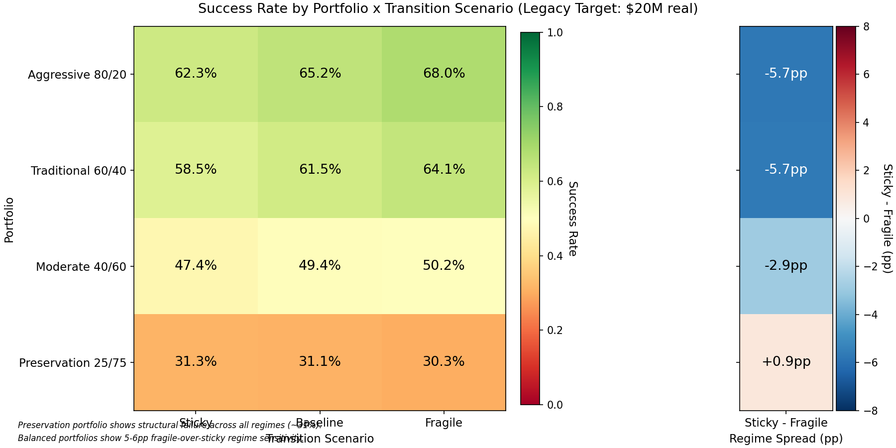
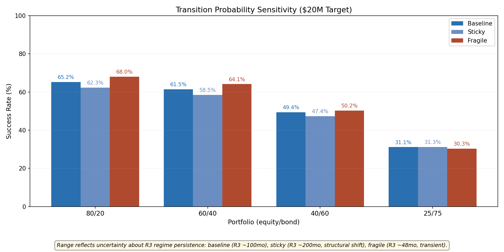
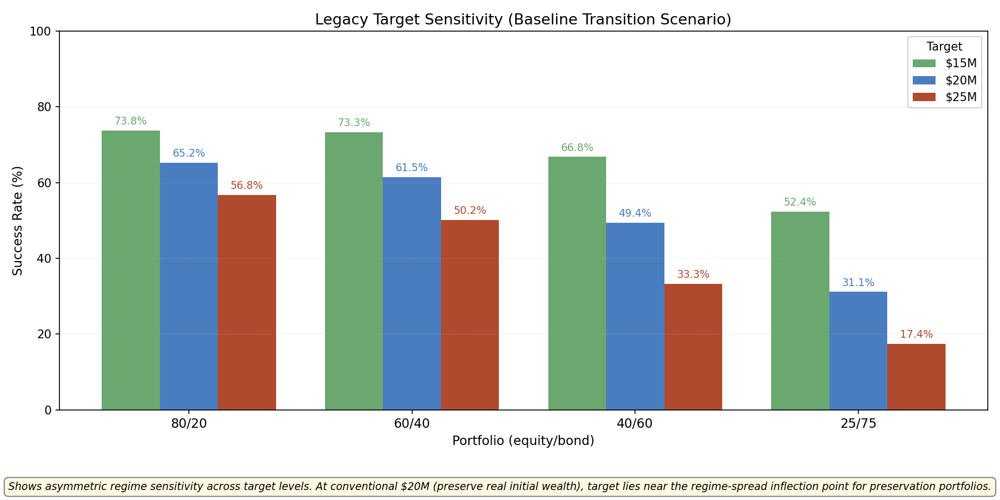
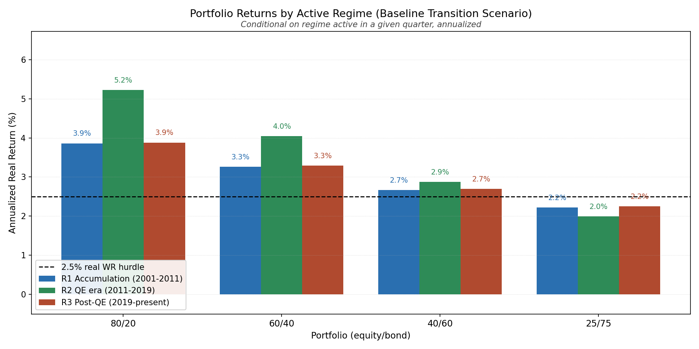
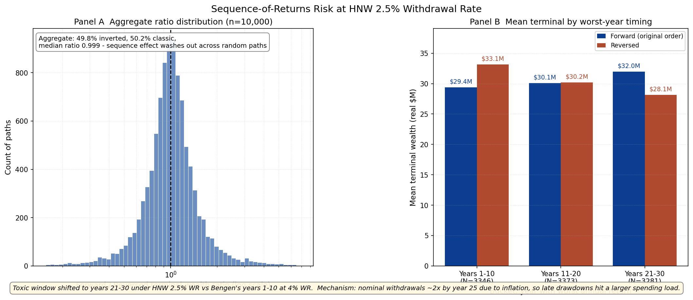
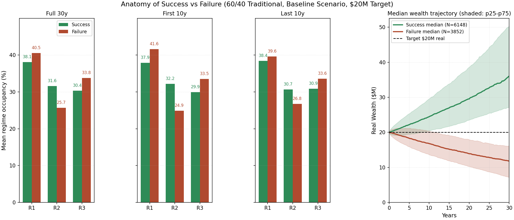

# Wealth Projection Engine: Regime-Switching Monte Carlo for HNW Legacy Planning

This project models 30-year wealth preservation outcomes for an HNW client ($20M, 2.5% real withdrawal, $20M real-principal legacy target) using regime-switching Monte Carlo over three macroeconomic regimes identified via Bai-Perron breakpoints (2001/2011/2019). The headline finding is that conventional 'preservation' allocations - bond-heavy 25/75 portfolios commonly recommended for HNW capital preservation - fail the real-principal target in roughly 69% of paths regardless of which regime persistence scenario unfolds, revealing that a portfolio optimized to feel safe is structurally mismatched with the goal of keeping real wealth intact. A second finding running through the analysis: R3's damage to balanced portfolios operates through second-moment channels (volatility, correlation breakdown) rather than first-moment return impairment - forward equity mean is set identically in R1 and R3, yet portfolio outcomes diverge through correlation regime change.

Methodology centers on hybrid CMA calibration (empirical sigma and correlation over Bai-Perron regime windows, forward-looking mu) and explicit regime-persistence sensitivity.

See [Findings](#primary-findings) for detailed results, or [Reproducing](#reproducing) for setup instructions.

## Client Persona

The engine is calibrated to a representative HNW retiree: age 65, $20M investable wealth, 30-year planning horizon, $500K annual real spending (a 2.5% initial real withdrawal rate, inflation-indexed through the horizon), and a $20M real-principal legacy target - the standard HNW convention of preserving initial real wealth for the next generation rather than drawing down.

Because the withdrawal rate is well below classic Bengen 4% retirement research (which targets pure solvency over 30 years), the success criterion shifts. Nearly every path stays solvent at 2.5% WR; the binding question is whether terminal wealth beats its own starting real value 30 years later. That shifts sequence-of-returns risk away from the first decade (classic Bengen territory) and toward later years: inflation-indexed nominal withdrawals are roughly 2x larger by year 25 than at year 1, so late drawdowns do more damage than early ones.

Account structure (taxable / traditional / Roth mix, asset location, turnover, harvesting, step-up at death) is held out of this iteration. The baseline runs on a single tax-deferred pool. Rigorous tax-aware modeling is deferred to Phase 2.

## Scope

**In scope:**
- 4 portfolio allocations (80/20 aggressive, 60/40 traditional, 40/60 moderate, 25/75 preservation)
- 3 transition probability scenarios (baseline R3 ~100 months, sticky ~200 months, fragile ~48 months)
- Quarterly rebalancing
- 10,000 Monte Carlo paths x 30 years x 4 portfolios x 3 scenarios = 120,000 simulations
- Inflation: 2.5% baseline, R3 stress test at 4%

**Deferred to Phase 2:**
- Tax-aware account modeling (location, turnover, harvesting, step-up)
- Wealth transfer overlays (GRAT / IDGT / CLAT)
- Dynamic withdrawal strategies (Guyton-Klinger guardrails)
- Threshold-based rebalancing
- Alternative assets (PE, hedge funds, real estate)
- Stochastic inflation with Fed reaction function
- Bayesian transition matrix updating

## Methodology

### Data

Monthly return data from CRSP via WRDS: the value-weighted equity index (`vwretd`) for the equity leg, and the CRSP Fixed Term 10-Year Nominal Treasury Index (`tfz_mth_ft`, `kytreasnox = 2000007`) for the bond leg. Sample spans January 1990 through December 2024. Calibration data through Dec 2024 (most recent full month at WRDS extraction time). Three regimes are identified via Bai-Perron breakpoints carried forward from the preceding capstone analysis: R1 Accumulation (2001-01 to 2011-04, 124 months), R2 QE Era (2011-05 to 2019-01, 93 months), R3 Post-QE (2019-02 onward, 71 months as of calibration).

### Capital Market Assumptions

The calibration is hybrid. Volatility and correlation are estimated empirically from the regime sub-samples. Expected returns are set forward-looking, not taken from realized historical mu over the same window. Using realized historical mu would over-extrapolate the 2020-2024 AI rally into a 30-year forward expectation for R3 (14.7% realized equity return) and correspondingly under-extrapolate the 2000s "lost decade" for R1 (5.2%). Forward-looking mu is standard institutional CMA practice (see GSAM and BlackRock published CMAs).

| Regime | Equity mu | Equity sigma | Bond mu | Bond sigma | Correlation |
|---|---|---|---|---|---|
| R1 (2001-2011) | 7.0% | 16.9% | 4.0% | 7.7% | -0.32 |
| R2 (2011-2019) | 9.0% | 12.1% | 3.0% | 5.7% | -0.38 |
| R3 (2019-present) | 7.0% | 17.6% | 4.0% | 8.4% | +0.27 |

*mu values are forward-looking annualized; sigma and correlation are empirical from regime sub-samples (n = 124, 93, 71 months respectively).*

### Transition Probability Calibration

Calibrated to observed regime durations, with `p_exit_per_quarter = 4 / avg_duration_months`. R1 and R2 exit probabilities come from observed durations. R3 has no observed exit in sample, so it is modeled with three scenarios that span a structural-to-transient interpretation of the post-2019 regime:

| Scenario | R3 Expected Duration | R3 Exit Probability (per quarter) |
|---|---|---|
| Baseline | 100 months (R1/R2 median) | 0.040 |
| Sticky | 200 months (structural shift) | 0.020 |
| Fragile | 48 months (transient aberration) | 0.083 |

Off-diagonal transitions use an equal-probability split across the two non-current regimes (uninformative prior - the historical sample has at most one observed transition between any pair, insufficient to estimate directional preferences). Stationary distributions verified to approximately match observed historical regime time-share.

### Monte Carlo Engine

10,000 paths x 120 quarters per path (30 years x 4 steps/year). Each path's initial regime is sampled from the stationary distribution of its scenario's transition matrix, rather than starting from a fixed regime - this keeps regime dynamics distinguishable from initial-condition effects over the 30-year horizon. Within each regime, quarterly (equity, bond) returns are drawn from a bivariate normal parameterized by regime mu, sigma, and correlation; mixture across three regimes generates leptokurtic unconditional returns natively, so there is no need to impose t-distribution marginals on top (which would double-count the fat-tail mechanism).

## Primary Findings

### Finding 1: Preservation Paradox - "Safe" Portfolios Structurally Fail the Real-Principal Target

The 25/75 preservation portfolio hits the $20M real-principal target in 30.3-31.3% of paths across fragile/baseline/sticky scenarios - it fails in roughly 69% of paths regardless of regime persistence assumption. By comparison, 60/40 hits the target in ~62% of paths under baseline, and 80/20 in ~65%. The 30pp success gap between preservation and aggressive is the largest axis of variation in the MVP output.

The paradox: industry convention frames bond-heavy allocations as "safer" for preservation-focused HNW clients. Under a real-wealth preservation criterion, the opposite holds. 25/75 is only "safer" when the objective is nominal solvency or drawdown depth; when the objective is keeping real principal intact over 30 years, bond-heavy becomes near-certain failure.

The mechanism is structural. Regime-attribution data shows 25/75's annualized real return ceiling at 2.0-2.25% across regimes (R1 2.22%, R2 1.99%, R3 2.25%) against a 2.5% real withdrawal hurdle. The portfolio cannot simultaneously cover spending and grow - every quarter erodes real principal by the gap, with no regime offering escape because the bond allocation caps achievable real return. The median 25/75 baseline trajectory ends at $15.6M real, clearly below the target line.

Implication: HNW preservation framing needs refinement. "Preserve capital" via bond-heavy allocation is not equivalent to "preserve real wealth" - the two diverge by ~30pp of success probability in this setup.



### Finding 2: Regime Sensitivity Concentrated in Balanced Portfolios

Regime persistence matters for balanced portfolios, not for preservation. Success-rate spread between sticky and fragile R3 scenarios at the $20M target: 80/20 and 60/40 both show ~5.7pp, 40/60 shows 2.9pp, 25/75 shows 0.9pp - essentially regime-insensitive for the bond-heavy case.

The mechanism runs through the equity-bond correlation channel. R3's realized correlation is +0.27; R1 and R2 are -0.32 and -0.38. When both assets move together, the diversification benefit that balanced portfolios depend on evaporates - portfolio volatility rises without compensating return improvement. The effect is largest for allocations that lean on cross-asset hedging, which is precisely what 60/40 is built to exploit.

Preservation 25/75 does not lean on hedging the same way. Bond returns dominate the portfolio independent of correlation sign, so whether R3 lasts 48 or 200 months changes little. The portfolio is regime-insensitive at the mechanism level because bond returns dominate portfolio outcomes regardless of equity-bond correlation structure - the equity sleeve is too small (25%) to materially change portfolio variance through correlation effects.

Implication: retail advisory framing that treats R3 as uniformly bad for preservation-oriented clients is empirically misdirected under this CMA. The post-QE regime damages diversified balanced portfolios, not bond-heavy ones. Clients who feel exposed to R3 because they own a "preservation" allocation are worried about the wrong risk - their allocation's failure mode is insufficient return, not regime change.



### Finding 3: Asymmetric Correlation Effect Across Target Levels

Preservation's regime sensitivity is not just small, it changes sign as the legacy target moves. Sticky-minus-fragile spread for 25/75 at three target levels:

| Target | Sticky - Fragile spread | Direction |
|---|---|---|
| $15M | -1.2pp | Fragile wins |
| $20M | +0.9pp | Inflection |
| $25M | +2.4pp | Sticky wins |

Balanced portfolios (80/20, 60/40, 40/60) keep a consistent fragile-beats-sticky spread of 3-6pp at every target. Only preservation flips.

The mechanism is asymmetric tail behavior under positive correlation. At a low target like $15M, success is driven by downside protection - the question is "does the portfolio avoid getting dragged below $15M?" - and positive correlation makes bad outcomes worse because both assets fall together, so sticky (more R3 time) loses. At a high target like $25M, success requires the lucky upside tail; positive correlation in R3 helps that tail because both assets co-move up, amplifying good paths.

The conventional $20M target (preserving initial real principal) sits very close to the inflection point. This is a non-obvious result and runs against industry literature, which typically frames regime-conditional correlation as unambiguously bad for preservation. The direction actually depends on which side of the distribution determines success.



### Finding 4: Conditional on Regime, R1 and R3 Mean Returns Are Identical - Damage Is Second-Moment

Regime attribution shows that quarterly-annualized real portfolio returns conditional on regime are nearly identical between R1 and R3 across all allocations:

| Portfolio | R1 | R2 | R3 | R1 vs R3 |
|---|---|---|---|---|
| 80/20 | 3.86% | 5.22% | 3.88% | 0.02pp |
| 60/40 | 3.26% | 4.05% | 3.29% | 0.03pp |
| 40/60 | 2.67% | 2.87% | 2.69% | 0.02pp |
| 25/75 | 2.22% | 1.99% | 2.25% | 0.03pp |

This is by construction. The hybrid CMA sets equity mu forward-looking at 7.0% in both R1 and R3, and bond mu at 4.0%. The only differences are volatility (R3 equity sigma 17.6% vs R1 16.9%; bond sigma 8.4% vs 7.7%) and correlation (R3 +0.27 vs R1 -0.32).

Yet success rates and terminal wealth distributions diverge meaningfully between R1-dominated and R3-dominated paths. The divergence has to come through second-moment channels: higher volatility drag on the geometric mean, and loss of the diversification benefit that negative correlation provides to balanced allocations.

Implication: regime-conditional CMA discussions commonly conflate first-moment and second-moment effects. Telling a client "post-QE has worse expected returns" is empirically wrong under this CMA. The accurate framing: "post-QE has the same expected returns as R1, but the same return arrives via a more volatile, less hedged path." That distinction matters for client response: first-moment impairment would justify reducing equity weight; second-moment impairment leaves the optimal allocation question more open and shifts attention toward path dependency rather than expected return.



### Finding 5: HNW-Shifted Sequence Risk Window - Year 21-30, Not Year 1-10

Across all 10,000 paths (60/40 baseline), the aggregate forward-vs-reversed terminal wealth ratio is essentially symmetric around 1.0: 49.8% inverted, 50.2% classic, median ratio 0.999. Sequence effect washes out in aggregate.

The signal is in the stratification. When paths are bucketed by which year carried the worst annual return:

| Worst year | Mean forward terminal | Mean reversed terminal | Direction |
|---|---|---|---|
| 1-10 | $29.4M | $33.1M | Classic (reversed wins by $3.7M) |
| 11-20 | $30.1M | $30.2M | Tie |
| 21-30 | $32.0M | $28.1M | HNW-shifted (forward wins by $3.9M) |

The classic Bengen mechanism depends on early drawdowns consuming a high percentage of a depleted portfolio through a 4% withdrawal rate. At HNW 2.5% WR, early withdrawals are trivial (~0.6% per quarter of $20M) so early drawdowns barely dent the path. By year 25, inflation-indexed nominal withdrawals have roughly doubled - spending load as a fraction of portfolio is much larger, so late drawdowns cause proportionally more damage.

Implication: the toxic-sequence window shifts from years 1-10 to years 21-30 under HNW conditions. Standard 4% WR retirement research does not reveal this because the withdrawal mechanism dominates throughout the horizon. For HNW preservation planning, the right place to worry about market drawdowns is late, not early - contrary to both Bengen convention and the instinct that the first decade is the riskiest.



### Finding 6: Early R2 Exposure Discriminates Success - Compounding Beats Avoidance

Splitting the 60/40 baseline output into success (terminal real >= $20M, N=6148) and failure (N=3852) subsets, the most discriminating variable is early R2 exposure, not R3 avoidance:

| Metric | Success | Failure | Gap |
|---|---|---|---|
| First 10yr R2 fraction | 32.2% | 24.9% | 7.3pp |
| Full horizon R2 fraction | 31.6% | 25.7% | 5.9pp |
| Last 10yr R2 fraction | 30.7% | 26.8% | 3.9pp |
| Full horizon R3 fraction | 30.4% | 33.8% | 3.4pp |
| Starting regime R3 | 29.6% | 31.9% | 2.3pp |

The R2 gap is largest in the first decade (7.3pp) and shrinks over the horizon. R3 occupancy gaps are smaller and roughly constant across windows. Starting regime barely matters - a 2.3pp difference in P(R3 start) is far below the first-decade R2 exposure gap.

The mechanism is compounding. R2 is the high-return regime for 60/40 (4.05% real annualized). Catching R2 early, when the portfolio is near its starting size and has 30 years of compounding ahead, multiplies the advantage across the whole horizon. Catching R3 late, after wealth dispersion has already crystallized, has smaller cumulative effect than missing R2 early.

Caveat: this is an ex-post decomposition. R2 exposure and good outcomes are mechanically correlated because R2 has the highest conditional return for 60/40. The finding is not that R2 exposure causes success in any causal sense - it is that R2 exposure is the single largest driver of terminal wealth dispersion in the path population, more than R3 avoidance. The implication is about which risk dimension matters most for distribution shape, not a causal claim that managing R2 timing would change client outcomes.

Implication: what separates winners from losers is path-luck on R2 timing, not R3 avoidance. That reframes the regime conversation with a client - the question is not "how do we avoid R3" but "what happens if R2 does not arrive early." The risk is timing-sensitive, which invites tactical rather than strategic responses.



## Secondary Findings

### Transition Probability Sensitivity

The data underlying Finding 2 can be read as a direct sensitivity measurement. Success-rate spread between sticky and fragile R3 scenarios at the $20M target: 80/20 5.7pp, 60/40 5.7pp, 40/60 2.9pp, 25/75 0.9pp.

Headline: regime-persistence uncertainty is bounded. Even in the structural-shift sticky scenario, balanced portfolios lose at most ~6pp of success probability versus the transient fragile scenario. That envelope is narrow enough to report without collapsing it to a single point estimate, and it supports the methodology choice to model R3 with three scenarios rather than committing to a single duration assumption. The result surface is well-defined across the plausible range of R3 persistence views.

### Target Sensitivity and Aggressive Upside Reach

Building on Finding 3's sweep across $15M / $20M / $25M targets, an additional pattern not emphasized in Finding 3 is that 80/20 and 60/40 converge at low targets. At $15M the two portfolios are nearly tied (73.8% vs 73.3%, 0.5pp gap). At $25M, 80/20 leads 60/40 by 6.6pp (56.8% vs 50.2%).

Mechanism: at low targets both portfolios meet the bar via risk-adjusted return and balanced is sufficient. At high targets, reaching the bar requires upside tail capture, which only equity-heavy portfolios reliably deliver.

Implication: optimal allocation is target-dependent. A 60/40 default for "moderate growth" holds only if the legacy target is moderate; stretch targets shift the answer toward equity-heavy.

### R3 Inflation Stress: Conventional Wisdom Confirmed

Stress test: inflation runs at 4% annualized during R3 quarters, 2.5% otherwise. Absolute success-rate drops at the $20M target (baseline vs stressed): 80/20 -7.7pp, 60/40 -10.1pp, 40/60 -12.7pp, 25/75 -11.5pp.

The absolute pp drops appear to peak at 40/60, but this is a floor effect - 25/75's absolute drop is compressed because its baseline success rate (31%) is already near the failure floor. Relative drops tell the conventional story: 80/20 -12%, 60/40 -16%, 40/60 -26%, 25/75 -37%.

Bond-heavy portfolios take the largest proportional damage. The conventional inflation-sensitivity hierarchy (more bonds = more inflation risk) is confirmed in proportional terms; absolute pp drops mislead due to floor effects.

## Phase 2 Extensions

This iteration deliberately limits scope to validate the regime-switching mechanic and the hybrid CMA framework. Several extensions are well-defined but require infrastructure beyond the current scope. The most significant is rigorous tax-aware modeling, which is non-trivial because realistic HNW tax behavior depends on account structure, turnover, and harvesting - variables that interact with the Monte Carlo paths in ways that need their own design choices.

### Tax-Aware Wealth Modeling

Rigorous tax drag analysis requires asset location across taxable / tax-deferred / Roth accounts, turnover rate modeling (empirically 30-50% for HNW), tax-loss harvesting effects, holding-period distinctions, and step-up in basis at death (material for legacy contexts). Horan (2007) reports approximately 1.5% effective equity tax drag on historical 10% mu for tax-efficient HNW management; scaled to my forward 7% mu this implies roughly 1.0% absolute drag, translating to approximately 8-12pp success rate reduction for balanced portfolios. Implementing this rigorously requires account-level simulation beyond the current project scope.

### Wealth Transfer Overlays

Conventional HNW preservation work is incomplete without the wealth transfer dimension. GRATs, IDGTs, and CLATs interact with the preservation question by changing what "preserve real principal" even means - a structure that distributes appreciation to heirs at gift-tax exclusion levels effectively raises the achievable real wealth target without raising the in-trust portfolio's hurdle. A complete model would overlay GRAT laddering and IDGT structures on the regime-switching core. The success rates reported here are the no-transfer baseline.

### Other Extensions

- Dynamic withdrawal strategies (Guyton-Klinger guardrails, RMD-style schedules) - currently fixed real WR
- Threshold-based rebalancing replacing quarterly rebalancing
- Alternative assets (PE, hedge funds, real estate) - currently equity + bond two-asset only
- Stochastic inflation with explicit Fed reaction function - currently deterministic 2.5% with R3 stress test
- Bayesian transition matrix updating using realized regime evidence rather than fixed prior

## Intellectual Honesty and Limitations

Several findings in this analysis went through revision after closer inspection revealed they were artifacts of measurement framing or selection rather than robust patterns. The list below catalogs the methodology choices and limitations a careful reviewer would push back on, both for transparency and because filtering out artifact findings is itself a research signal.

- **Forward CMA vs historical observation distinction.** The Capital Market Assumptions used for return calibration are forward-looking, not historical realizations. Findings stated as conditional on these CMAs (e.g., "preservation 25/75 fails in 69% of paths") are model-conditional, not historical claims. Historical 2011-2019 bond returns, for example, were better than my R2 forward bond mu of 3% would suggest.
- **Endogeneity in winning/losing path decomposition.** Finding 6's R2-exposure-discriminates-success result is mechanically correlated: R2 has the highest conditional return for 60/40 in this CMA, so paths spending more time there end up with more wealth almost by construction. The finding is descriptive (which dimension discriminates the distribution most), not causal.
- **Multivariate normal limitation.** Returns within each regime are drawn from bivariate normal. Crisis regimes (2008, 2020) showed return distributions with kurtosis beyond what normal captures even conditional on regime. The mixture across three regimes generates some leptokurtosis, but it likely underestimates true tail risk in R3 crisis-like conditions.
- **Tax drag analysis simplified out.** The initial tax implementation (15% cap gains applied to every positive equity quarter, no loss offset) did not represent any realistic HNW tax scenario. Rather than report misleading numbers, tax modeling is deferred to Phase 2. Literature-based estimates suggest 8-12pp success rate impact for balanced portfolios under realistic tax-efficient management.
- **Sequence risk reported via distribution, not single path.** An earlier iteration of Finding 5 framed the sequence-of-returns inversion based on a single path at the 5th percentile of early-return mean. That framing was an overclaim - the inversion is present in some paths but not systematic. The current framing uses the full distribution and stratification by worst-year timing, which is more defensible and produces a richer finding.
- **R3 calibration uncertainty.** R3 has only 71 months of data (24 quarters), which is below conventional thresholds for stable parameter estimation. Sigma and correlation estimates have wide confidence intervals. The three-scenario transition design (baseline / sticky / fragile) addresses persistence uncertainty but does not address parameter estimation uncertainty within R3.
- **Target-driven interpretation.** All findings depend on the $20M real legacy target as the success criterion. This is the HNW convention of preserving initial real principal, not a universal benchmark. Different targets produce different rankings, as Finding 3 demonstrates explicitly. Generalizing the findings beyond preservation-focused HNW clients would require re-running with different target structures.

## Reproducing

All scripts run from the project root. WRDS access is required for data refresh, but cached parquet files in `artifacts/data/` allow the analysis pipeline to run without re-pulling. Total compute time for the full analysis is under 10 seconds on a modern laptop.

### Environment

```
Python 3.10+
numpy, pandas, scipy, matplotlib
wrds (only required for data refresh)
```

WRDS credentials should be configured per WRDS documentation. The loaders read from `crsp.msi` (equity) and `crsp.tfz_mth_ft` (bonds).

### Run Order

1. **Data refresh (optional)**: run

   ```
   python -c "from data.wrds_loader import load_equity_monthly, load_bond_monthly; load_equity_monthly(refresh=True); load_bond_monthly(refresh=True)"
   ```

   to repopulate `artifacts/data/`. Skip if cached parquet files are already present.
2. **Calibration**: `python scripts/calibrate_regimes.py` produces `artifacts/results/regime_params_final.json` with the hybrid CMA parameters.
3. **Transition matrices**: `python scripts/verify_transitions.py` builds the three transition matrices (baseline / sticky / fragile) and writes `artifacts/results/transition_matrices.json`.
4. **Full Monte Carlo**: `python scripts/run_full_mvp.py` runs all 12 portfolio x scenario combinations (10,000 paths each) and saves to `artifacts/results/full_mvp.pkl`.
5. **Engine validation (optional)**: `python scripts/bengen_benchmark.py` runs the Bengen 4% WR / 60-40 / 30-year benchmark for engine validation. Expected success rate ~89-90% (the 5pp gap vs Bengen's classic 95% reflects MVN volatility drag, not an engine error).
6. **Visualization and analysis**: any of the visualization and analysis modules can be invoked independently (`visualization/heatmap.py`, `visualization/fan_chart.py`, `visualization/sequence_risk.py`, `analysis/regime_attribution.py`, `analysis/winning_losing.py`). All outputs land in `artifacts/figures/`.

### Project Structure

```
wealth-projection/
├── config.py                         # CMA, transitions, portfolios, target
├── data/
│   └── wrds_loader.py                # WRDS pull + parquet cache
├── calibration/
│   ├── regime_params.py              # Hybrid CMA estimation
│   └── transition_matrix.py          # 3-scenario transition matrices
├── simulation/
│   └── monte_carlo.py                # Vectorized regime-switching engine
├── visualization/
│   ├── heatmap.py                    # Primary Output 1
│   ├── fan_chart.py                  # Primary Output 2
│   └── sequence_risk.py           # Primary Output 3
├── analysis/
│   ├── regime_attribution.py         # Primary Output 4
│   └── winning_losing.py             # Primary Output 5
├── scripts/                          # Calibration, MC runs, sensitivity
└── artifacts/
    ├── data/                         # Cached return data (parquet)
    ├── results/                      # JSON + pickle outputs
    └── figures/                      # Generated PNGs
```

## License

MIT License. See [LICENSE](LICENSE) for details.
